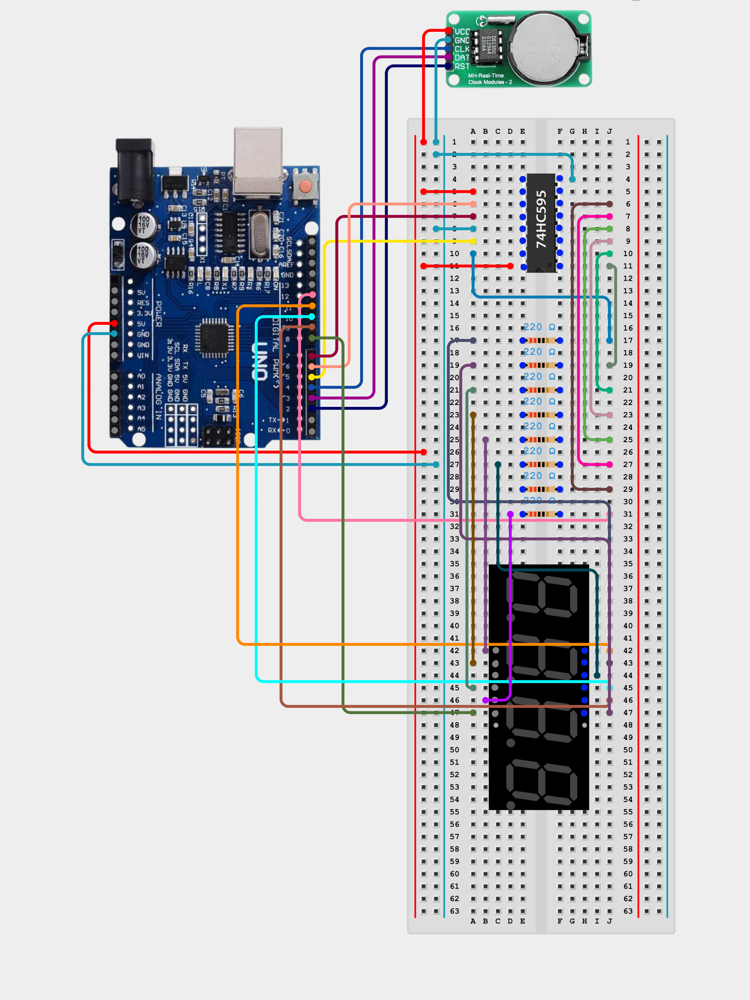

# Live Clock

This is a DIY live clock built with C++.

## Getting Started

### Dependencies

Before running this project, make sure that the following is installed:
* Arduino IDE/CLI
* [Libraries](libs/DS1302.zip)
* Drivers for your specific Arduino board

### Components

* Arduino board
* DS1302 clock module
* 8bit SPO shift register (74HC164 or 74HC595)
* 8 × 220Ω resistors
* 7 segments 4 digits display

### Circuit diagram

Refer to the wiring setup before powering the board:

